# Amplitude Damping Channel

### Prove that it forms a Semigroup

A map (channel) is a Semigroup if $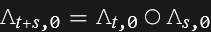$.
So, if $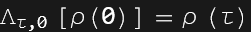$, we have:
    $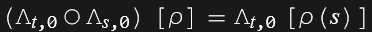$, and that should be equal to $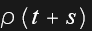$.
In this case the map is given in terms of its Kraus Operators $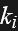$.

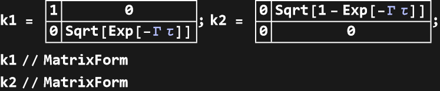

|  |  |
| - | - |
| 1 | 0 |
| 0 | -Power- |

|  |  |
| - | - |
| 0 | -Power- |
| 0 | 0 |

```wl
In[]:= \[CapitalLambda][x_, t_] := Module[{k1t, k2t, \[Rho]t}, 
    k1t = k1 /. \[Tau] -> t; 
    k2t = k2 /. \[Tau] -> t; 
    \[Rho]t = k1t . x . ConjugateTranspose[k1t] + k2t . x . ConjugateTranspose[k2t]; 
    Simplify[\[Rho]t, Assumptions -> {\[CapitalGamma] > 0, t > 0 }] 
   ]
```

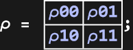

```wl
In[]:= \[Rho]\[Tau] = \[CapitalLambda][\[Rho], \[Tau]];
 \[Rho]\[Tau] // MatrixForm
```

|  |  |
| - | - |
| -Plus- | -Times- |
| -Times- | -Times- |

First we compute $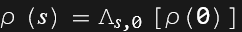$,

```wl
In[]:= \[Rho]s = \[CapitalLambda][\[Rho], s];
 \[Rho]s // MatrixForm
```

|  |  |
| - | - |
| -Plus- | -Times- |
| -Times- | -Times- |

Then $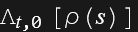$,

```wl
In[]:= \[Rho]ts = \[CapitalLambda][\[Rho]s, t];
 \[Rho]ts // MatrixForm
```

|  |  |
| - | - |
| -Plus- | -Times- |
| -Times- | -Times- |

Now we check that this is equal to $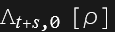$,

```wl
In[]:= \[Rho]ts == \[CapitalLambda][\[Rho], t + s]
```

```wl
Out[]= True
```

### Petz Recovery Map

The recovery map is defined as: $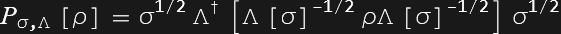$, where $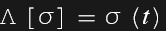$, such that:
    $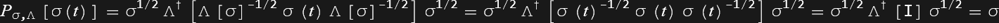$
(we reversed the time evolution from $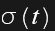$ to $$.

```wl
In[]:= Petz[Ks_, t_, \[Sigma]_, \[Rho]_] := Module[{innerMatrix, Phi, PhiAdj, recovered}, 
    Phi[rho_] := Total[(# . rho . ConjugateTranspose[#]) & /@ Ks /. \[Tau] -> t]; 
    PhiAdj[X_] := Total[(ConjugateTranspose[#] . X . #) & /@ Ks /. \[Tau] -> t]; 
    innerMatrix = (Phi[\[Sigma]])^(-1/2) . \[Rho] . (Phi[\[Sigma]])^(-1/2); (*TODO: Use the correct Power Operator for matrices (this takes the sqrt element by element)*)
    recovered = \[Sigma]^(1/2) . PhiAdj[innerMatrix] . \[Sigma]^(1/2); 
    FullSimplify[recovered, Assumptions -> {\[CapitalGamma] > 0, t > 0 }] 
   ]
```